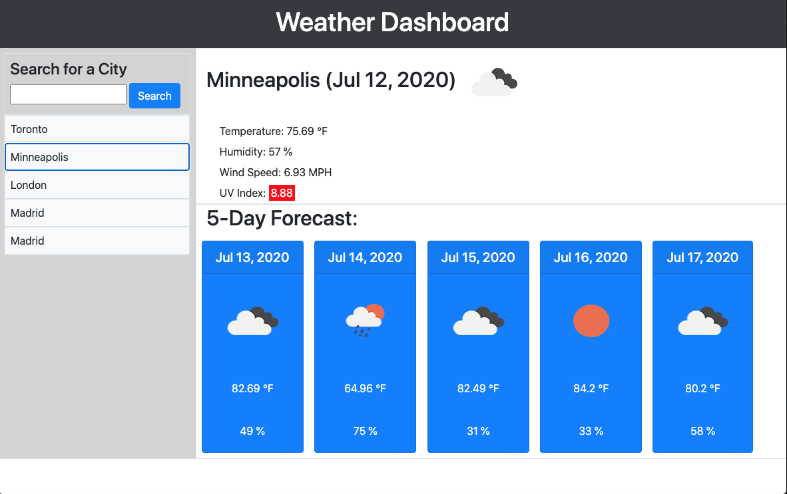

# 06 Server-Side APIs: Weather Dashboard

Developers are often tasked with retrieving data from another application's API and using it in the context of their own. Third-party APIs allow developers to access their data and functionality by making requests with specific parameters to a URL. Your challenge is to build a weather dashboard that will run in the browser and feature dynamically updated HTML and CSS.

Use the [OpenWeather API](https://openweathermap.org/api) to retrieve weather data for cities. The documentation includes a section called "How to start" that will provide basic setup and usage instructions. Use `localStorage` to store any persistent data.

## Weather Dashboard

## Purpose

This is a web-based weather dashboard that is built to show you the weather of a current city and its forecast for 5 days when you search. 

It will display the city name, temperature, date, humidity, wind speed and UV Index for the city at that particular time along withh an icon. You owill also see displayed the temperature, date, humidity and wind speed for the following five days along with an icon.

UV Index is indicated with red, yelllow, or green to display the severity of index. 

Once you have searched a city, it will display on the left side of the screen for you to easily navigate back to that city. 

## Website
* HTML
* Javascript
* CSS
* Bootstrap
* Moment.js
* Open Weather API

https://blee2013.github.io/weather/

